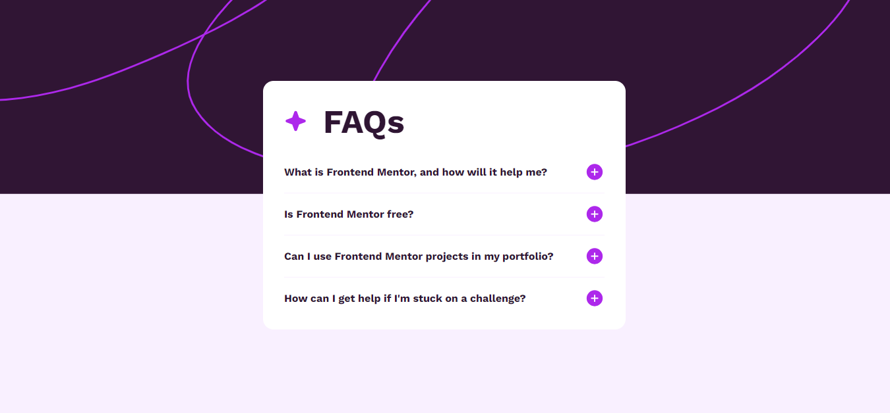
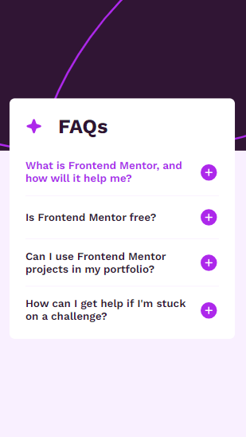

# Frontend Mentor - FAQ Accordion Solution

This is my solution to the [FAQ Accordion challenge on Frontend Mentor](https://www.frontendmentor.io/challenges/faq-accordion-wyfFdeBwBz). Frontend Mentor challenges help you improve your coding skills by building realistic projects.

## Table of Contents

- [Overview](#overview)
  - [The Challenge](#the-challenge)
  - [Screenshot](#screenshot)
  - [Links](#links)
- [My Process](#my-process)
  - [Built With](#built-with)
  - [What I Learned](#what-i-learned)
  - [Continued Development](#continued-development)
- [Author](#author)

---

## Overview

### The Challenge

Users should be able to:

- Hide/show the answer to each FAQ question when the question is clicked
- Navigate the questions using keyboard (for accessibility)
- View the optimal layout for the interface depending on their device's screen size
- See hover and focus states for all interactive elements on the page

### Screenshot

| Desktop | Mobile |
|---------|--------|
|  |  |

### Links

- **Solution URL:** https://github.com/IrfanAnsari21/FAQ-accordion
- **Live Site URL:** https://irfanansari21.github.io/FAQ-accordion/

---

## My Process

### Built With

- Semantic HTML5
- CSS3
- Flexbox
- Mobile-first workflow
- JavaScript (DOM manipulation)

### What I Learned

Working on this project helped me strengthen my understanding of:

**Toggle logic with JavaScript** — Managing the open/close state of each accordion item independently:

**CSS transitions for smooth expand/collapse:**

### Continued Development

In future projects, I want to focus on:

- Improving **accessibility** — ensuring accordion items are fully navigable via keyboard and properly announce state changes to screen readers using `aria-expanded` and `aria-controls`
- Adding **smooth animations** using the Web Animations API for more polished interactions

---

## Author

- **GitHub** – [@IrfanAnsari21](https://github.com/IrfanAnsari21)
- **Frontend Mentor** – [@IrfanAnsari21](https://www.frontendmentor.io/profile/IrfanAnsari21)

---

> Challenge by [Frontend Mentor](https://www.frontendmentor.io). Coded by **Irfan Ansari**.